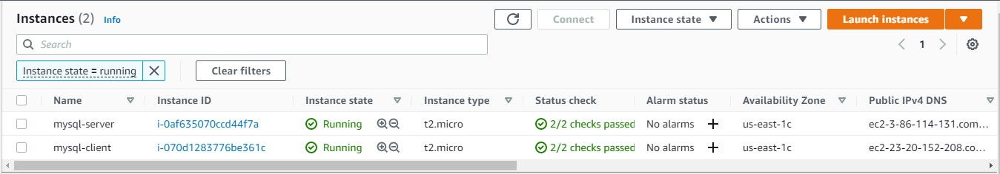
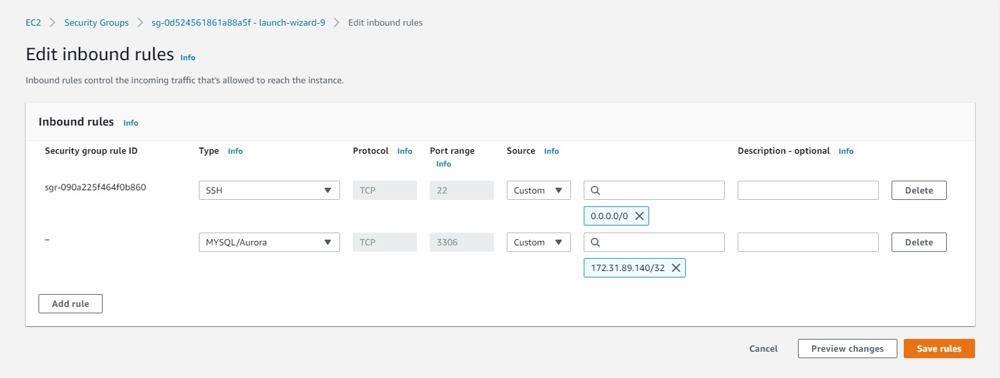

# **IMPLEMENT A CLIENT SERVER ARCHITECTURE USING MYSQL DATABASE MANAGEMENT SYSTEM (DBMS)** #

### **TASKS – Implement a Client Server Architecture using MySQL Database Management System (DBMS)** ###

1. Task One
  Create two EC2 Instance
  Name them mysql server and mysql client respectively
  ~~~
  mysql-server
  mysql-client
  ~~~
  
  
  
  Lunch the Instances, then update and upgrade them
  ~~~
  sudo apt update -y && sudo apt upgrade -y
  ~~~

1. Task Two
  On mysql-server, install mysql server package
  ~~~
  sudo apt install mysql-server -y
  ~~~
  
  On mysql-client, install mysql client package
  ~~~
  sudo apt install mysql-client -y
  ~~~
  
1. Task Three
  Allow mysql-client access mysql-server remotely through security group inbound rule.
  
  
  
1. Task Four
  COnfigure the mysql server to allow connection from remote hosts
  ~~~
  sudo vi /etc/mysql/mysql.conf.d/mysqld.cnf
  ~~~
  Replace the values of bind-address and mysqlx-bind-address with 0.0.0.0/0 from 127.0.0.1
  
  From
  
  
  To
  

