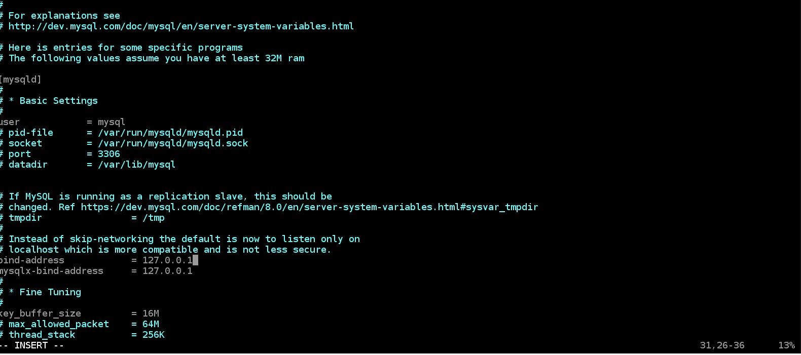
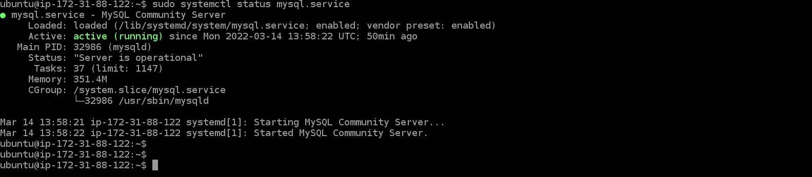
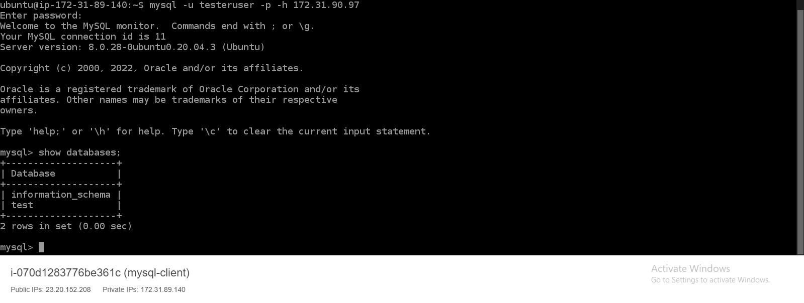
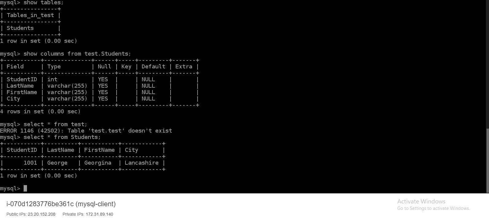

# **IMPLEMENT A CLIENT SERVER ARCHITECTURE USING MYSQL DATABASE MANAGEMENT SYSTEM (DBMS)** #

### **TASKS – Implement a Client Server Architecture using MySQL Database Management System (DBMS)** ###

1. **Task One**
  Create two EC2 Instance
  Name them mysql server and mysql client respectively
  ~~~
  mysql-server
  mysql-client
  ~~~
  
  
  
  Lunch the Instances, then update and upgrade them
  ~~~
  sudo apt update -y && sudo apt upgrade -y
  ~~~

2. **Task Two**
  On mysql-server, install mysql server package
  ~~~
  sudo apt install mysql-server -y
  ~~~
  
  On mysql-client, install mysql client package
  ~~~
  sudo apt install mysql-client -y
  ~~~
  
3. **Task Three**
  Allow mysql-client access mysql-server remotely through security group inbound rule.
  
  
  
4. **Task Four**
  COnfigure the mysql server to allow connection from remote hosts
  ~~~
  sudo vi /etc/mysql/mysql.conf.d/mysqld.cnf
  ~~~
  Replace the values of bind-address and mysqlx-bind-address with 0.0.0.0/0 from 127.0.0.1
  
  From
  
  
  To
  
  
  Confirm the server is running on mysql-server machine
  ~~~
  sudo systemctl status mysql
  ~~~
  
  
  
  Login to mysql on mysql-server as root user
  ~~~
  sudo mysql -u root
  ~~~
  Create a test database
  ~~~
  CREATE DATABASE test DEFAULT CHARACTER SET utf8mb4 COLLATE utf8mb4_unicode_ci;
  ~~~
  Create a database user and its password 
  ~~~
  create user 'testeruser' IDENTIFIED BY 'mysql';
  ~~~
  Grant Full Access to the user
  ~~~
  GRANT ALL ON test.* TO 'testeruser';
  ~~~
  
5. **Task Five**
  Go to mysql-client machine, login to MySQL database on mysql-server machine
  ~~~
  mysql -u testeruser -p -h 172.31.90.97
  ~~~
  Show databases on the remote MySQL server
  ~~~
  mysql> show databases;
  ~~~
  
  
  
  ### **Sample** ###
  

